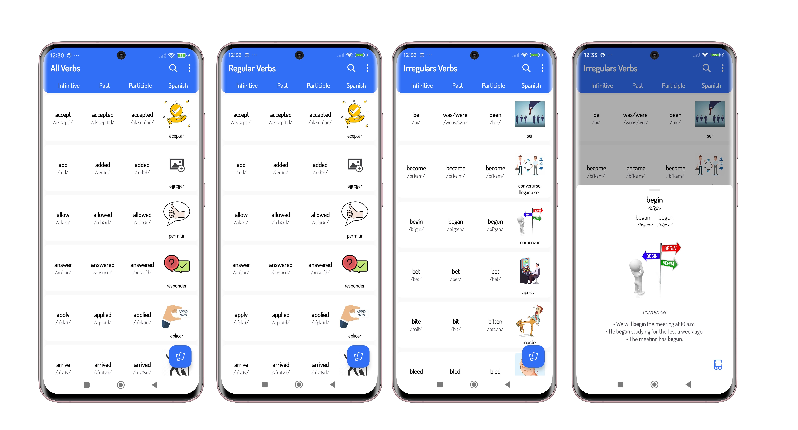

<h1 align="center">
   
  
   
  Verb List
   
</h1>

Android App built with the objective of learning regular or irregular verbs in English in an easy way
 <a href="https://github.com/EduardoAlonso73/listVerbs/releases/download/v1.0.0/VerbList.apk">Get the apk ⬇️</a>.</h4>

## Built With

The application is built with the MVVM presentation pattern and using a clean architecture as well as technology or library such as:

         

## Key Features

* Verbs in categories (Regular/Irregular) 
* Dark/Light mode
* Change the color of the application theme.
* Sort verbs alphabetically and in random order.
* Save learned verbs.
* Learning summary
* Hide images (Simple mode).

## 📦 Download

<a href='https://play.google.com/store/apps/details?id=com.alonsoapp.listverbs'>

## Preview

#### Video

#### Screenshots

